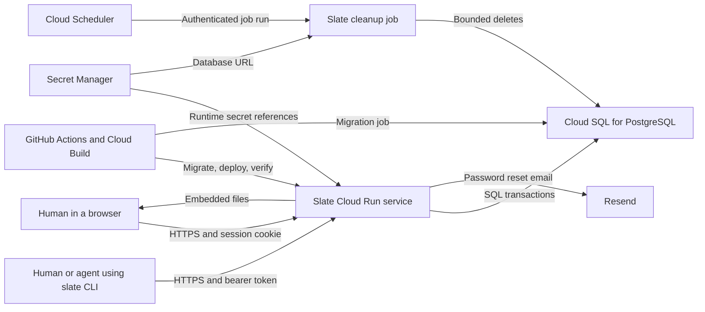
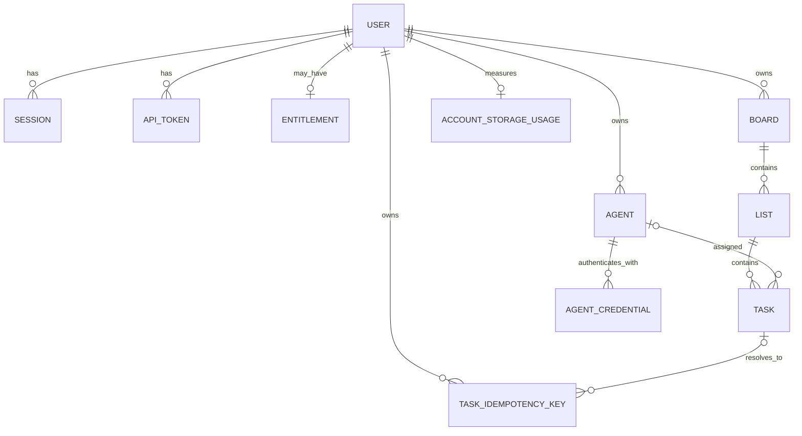

# Slate architecture

> **Status:** Current implementation
>
> **Verification basis:** Working tree based on `8a0d2b9`

## 1. Executive summary

Slate is a task manager for a person and their command-line agents. The current application is one Go service with an embedded HTML, CSS, and JavaScript frontend, a JSON HTTP API, and a PostgreSQL database. The same Go repository also builds the `slate` CLI. Production runs the service, database migration jobs, and a scheduled cleanup job in Google Cloud.

PostgreSQL is the source of truth. It stores accounts, sessions, access grants, boards, lists, tasks, agent identities and credentials, rate-limit state, idempotency records, and storage counters. Browser sessions, personal API tokens, and agent credentials all reach the same API, but they receive different authority.

The main rule is: every read and mutation must remain scoped to the authenticated account, and agent credentials must remain further scoped to that agent's assigned work. Browser checks and hidden controls are never an authorization boundary.

The approved task-first redesign in [issue #129](https://github.com/owainlewis/slate.do/issues/129) and [PR #130](https://github.com/owainlewis/slate.do/pull/130) is proposed work. It is not included in this current-state document.

## 2. System context



Inside the repository, `server/cmd/slate` builds the web service and operator commands. `cli/cmd/slate` builds the separate CLI. The browser frontend is embedded into the server binary by default. A `STATIC_DIR` override exists for local development.

## 3. Architectural invariants

1. **Account ownership is enforced in PostgreSQL queries.** Resource IDs are not sufficient authority. Board, list, task, agent, and token operations also match the authenticated account ID.
2. **Agent authority is narrower than account authority.** An agent credential can operate only on work assigned to its immutable agent ID. It cannot manage account-level resources or another agent's tasks.
3. **Authentication secrets are not recoverable.** Session tokens, personal API tokens, agent credentials, and password-reset tokens are stored as hashes. Plaintext API and agent tokens are returned only when created.
4. **Plans and limits are server owned.** A missing entitlement resolves to Free. An explicit `pro` entitlement can come from invite, Stripe, manual, or admin sources. The server and database enforce limits regardless of browser state.
5. **Task workflow states are fixed.** A task is `queued`, `working`, `needs_review`, or `done`. Claim and status transitions use database transactions so concurrent agents cannot both claim the same task.
6. **Task storage accounting changes with task data.** Every task has one account owner and generated text-byte usage. Application transactions and a database trigger keep per-account task and byte counters aligned with stored rows.
7. **Schema changes finish before a release serves traffic.** Migrations run under a PostgreSQL advisory lock. Cloud Build runs a commit-specific migration job before deploying the web revision.
8. **Database capacity fails closed.** The service verifies server capacity on startup, uses a small connection pool, claims distributed connection slots, applies database deadlines, and returns a stable service-unavailable response when capacity is exhausted.

## 4. Components and dependencies

| Component | Owns | Depends on | Does not own |
| --- | --- | --- | --- |
| Browser app (`server/internal/web/dist`) | Routes, rendering, forms, drag interactions, local view state | JSON API and static assets | Authorization, quotas, or durable data |
| HTTP composition (`server/internal/server`) | Route registration, auth guards, rate-limit coordination, HTTP errors, request deadlines, static fallback | Auth, boards, agents, rate limits, embedded web files | Domain persistence rules |
| Auth (`server/internal/auth`) | Accounts, password hashing, sessions, personal API tokens, registration, password reset, agent-token resolution | PostgreSQL, entitlements, Resend | Boards, lists, tasks, or agent work transitions |
| Entitlements (`server/internal/entitlements`) | Free and Pro resolution, limits, usage projection | Account, entitlement, and usage rows | Stripe billing state or checkout |
| Boards (`server/internal/boards`) | Boards, lists, tasks, ordering, assignment, workflow transitions, idempotent task creation, task storage quotas | PostgreSQL and authenticated identity | Authentication and agent lifecycle |
| Agents (`server/internal/agents`) | Agent profiles, credential rotation and revocation, archive and restore, assigned-work summaries | PostgreSQL and auth-owned agent records | General task ownership or account plans |
| Rate limits (`server/internal/ratelimit`) | Shared request windows, credential reservations, counters, metrics | PostgreSQL and route classification | Authentication decisions |
| Cleanup (`server/internal/cleanup`) | Bounded deletion of expired operational records | PostgreSQL and the retention policy | Customer-created task data or account deletion |
| Database and migrations | Pool deadlines, connection slots, schema versioning, schema invariants | PostgreSQL | HTTP behavior or product presentation |
| CLI (`cli/cmd/slate`) | Command parsing, JSON requests, JSON output | Public Slate API and a bearer token | Local durable state or direct database access |
| Delivery (`.github`, `cloudbuild.yaml`, `scripts`) | CI, image build, deployment lock, migration and cleanup jobs, health checks | GitHub Actions and Google Cloud | Product behavior |

Dependency direction is from delivery and interface code toward domain packages and PostgreSQL. The browser and CLI never connect to PostgreSQL. Domain packages do not import the browser or CLI.

## 5. Critical flows

### Browser sign-in and authenticated request

1. The browser submits email and password to `POST /api/v1/auth/login`.
2. The auth service normalizes the email, compares the bcrypt password hash, and creates a random session token.
3. PostgreSQL stores only the session-token hash and expiry. The browser receives the token in the `slate_session` cookie.
4. Later requests reserve rate-limit capacity for the credential before authentication. Successful authentication finalizes the credential and account limits together.
5. A route guard selects session-only, account-read, account-manage, or agent-aware authority.
6. The domain store repeats account and, where required, agent scoping in SQL.
7. Database timeout and capacity errors become a stable `503 service_unavailable` response. Authentication and authorization failures do not expose account data.

### Task creation and update

1. A session or account API token submits a bounded JSON request to a list task endpoint.
2. The handler validates text, dates, workflow values, assignment, and any `Idempotency-Key`.
3. The store starts a transaction and locks the account or affected ordering rows when required.
4. It checks the plan, board, list, active-item, stored-task, and stored-content limits. A lower list working limit may be bypassed explicitly, but the plan maximum may not.
5. It inserts or updates the task and adjusts ordering and storage counters in the same transaction.
6. An idempotent retry returns the original task. Reusing a key for different input returns a conflict. Deleting the original task leaves the established gone response until the key expires.
7. The transaction commits before the JSON response is returned.

### Agent work

1. An account owner creates an agent identity. Slate returns one `slate_agent_...` credential and stores only its SHA-256 hash and safe prefix.
2. A human assigns tasks to the agent's immutable ID.
3. The agent uses its token with the CLI or API to list assigned queued work.
4. Claiming a task atomically changes `queued` to `working`. A competing claim observes the committed state and fails safely.
5. The agent can update only its assigned task and can move it through the fixed workflow. General board, list, reorder, move, and delete operations remain unavailable.
6. Revoking a credential leaves identity and assignments intact. Archiving an agent revokes its active credential and removes it from future assignment choices while retaining historical assignment.

### Invite registration and password reset

Invite registration exists only when `INVITE_CODE` is configured. Registration consumes shared IP and normalized-email limits, stores a bcrypt password hash, grants Pro with source `invite_code`, creates a session, and seeds a default board. A duplicate email returns an explicit conflict, so a caller with the invite code can distinguish an existing account.

Password-reset requests are written to a PostgreSQL outbox before a generic response is returned. A worker sends mail through Resend and retries failures. Reset tokens are hashed, expire after one hour, and are subject to IP and token limits.

### Deploy and cleanup

1. GitHub Required CI runs PostgreSQL-backed Go tests, CLI tests, web unit tests, real Chromium tests, installer checks, Cloud Build checks, and release-artifact checks.
2. Cloud Build verifies the exact GitHub commit, builds and pushes one image, and acquires a deployment lock in Cloud Storage.
3. A one-off Cloud Run job applies migrations. Failure stops the release.
4. Cloud Build deploys the `slate` service by immutable image digest, verifies runtime identity and capacity settings, checks `/api/health`, and runs a concurrent capacity probe.
5. The same image updates the single-task cleanup job. Cloud Scheduler invokes it daily at 03:17 UTC.
6. Cleanup deletes only expired operational records in bounded, retry-safe batches. It reports backlog and budget state as JSON and leaves customer-created records untouched.

## 6. Interfaces and data

### Domain model



The code calls lists `buckets` in database and API paths. The UI and CLI call them lists.

| Record | Key data and rules | Owner |
| --- | --- | --- |
| User | Email, bcrypt password hash, display name, `admin` or `member`, theme, optional disabled time | Auth |
| Session | Hashed cookie token and expiry | Auth |
| API token | Hashed bearer token, name, last use, revocation | Auth |
| Entitlement | One optional `pro` row with invite, Stripe, manual, or admin source. No row means Free | Entitlements |
| Board | Name, visual background, ordering, maximum active tasks per list | Boards |
| List (`bucket`) | Board, name, goal, Inbox marker, working limit, ordering | Boards |
| Task | Board, list, title, description, planned date, fixed status, optional priority and agent assignment, ordering, done flag, generated storage bytes | Boards |
| Agent | Account-owned immutable identity, name, purpose, archive time | Agents and auth |
| Agent credential | Hashed token, display prefix, last use, revocation. At most one active credential per agent | Agents and auth |
| Storage usage | Stored task count and UTF-8 content bytes per account | Boards and database trigger |
| Rate-limit state | Hashed key by account, credential, or IP and route class | Rate limits |
| Operational records | Password-reset outbox and tokens, idempotency records, rate-limit metrics | Auth, boards, rate limits, cleanup |

### HTTP API

All JSON mutation bodies are limited to 64 KiB. Collection reads are bounded or paginated where history could grow.

| Area | Current endpoints |
| --- | --- |
| Health and identity | `GET /api/health`, `GET /api/v1/me`, `PATCH /api/v1/me` |
| Authentication | `POST /api/v1/auth/login`, `/register`, `/logout`, `/password-reset/request`, `/password-reset/confirm` |
| Personal API tokens | `GET` and `POST /api/v1/api-tokens`, `DELETE /api/v1/api-tokens/{id}` |
| Agents | `GET` and `POST /api/v1/agents`, detail and update by ID, assigned work, credential rotation and revocation, archive and restore |
| Boards | List, create, read, update, and delete under `/api/v1/boards` |
| Lists | Create and reorder under a board; read, update, and delete through `/api/v1/buckets/{id}` |
| Tasks | Create in a list, list and read, patch, move, reorder, change status, and delete |
| Agent task workflow | List assigned tasks, atomically claim, update status, and mark done under `/api/v1/agent/tasks` |

The repository has no OpenAPI document. Handler types, route registration, CLI behavior, and integration tests are the executable API specification.

### CLI and browser

The CLI supports authentication checks plus board, list, and task commands. It sends `SLATE_API_TOKEN` as a bearer token, defaults to `https://slate.do`, uses a 30-second client timeout, and prints successful results as JSON.

The browser application is static JavaScript served by the Go service. It uses the same JSON API and does not own durable application state. The embedded frontend and API are released in the same container image, so no separate frontend compatibility window exists.

## 7. Security and trust boundaries

- The public internet can reach the Cloud Run service. Request bodies, headers, cookies, bearer tokens, route IDs, and forwarded IP data are untrusted.
- Session cookies are HTTP-only, same-site protected, and secure in production. Each cookie contains a random bearer token, while PostgreSQL stores only its hash and expiry. The configured `SESSION_SECRET` is not used by the current session implementation.
- Passwords use bcrypt and are limited to bcrypt's supported byte range. Login and reset responses avoid account enumeration.
- Personal tokens and agent credentials are bearer secrets. Only hashes are stored. Agent credentials add assignment-level authorization after authentication.
- Account IDs come from the resolved credential, never from a client-supplied owner field. Stores include that ID in resource queries and mutations.
- Rate limits are stored in PostgreSQL so every Cloud Run instance shares the same decision state. Credential checks reserve capacity before authentication to prevent credential probing from bypassing limits.
- Cloud Run uses separate deploy, web, maintenance, and scheduler service accounts. The web identity can read only its runtime secrets and reach the named Cloud SQL instance. The scheduler can invoke only the cleanup job.
- Secret Manager supplies the database URL, session secret, Resend API key, and optional invite code. Secret values must not enter source, issue comments, URLs, or deployment logs.
- Migrations and cleanup run as the maintenance identity, outside the serving process. The public service cannot deploy infrastructure or invoke itself with maintenance authority.

## 8. Failure, capacity, and operations

Production is one regional stack in `europe-west1`: a public Cloud Run service, PostgreSQL 18 on Cloud SQL, Artifact Registry, Secret Manager, a cleanup Cloud Run Job, and Cloud Scheduler.

The service is configured for at most four normal instances, 16 concurrent requests per instance, and two pooled PostgreSQL connections per instance. A database-wide application slot cap allows 16 service connections and preserves 9 of the configured 25 connections for Cloud SQL, migrations, and operators. Pool acquisition stops after 2 seconds, statements and idle transactions after 10 seconds, application requests after 15 seconds, and the outer Cloud Run request after 20 seconds.

The service fails startup if database capacity is below configuration or if migrations fail. During operation, database acquisition, statement, idle-transaction, and request deadline failures return `503` rather than waiting without bound. `/api/health` verifies database reachability and reports the effective pool and application connection limits.

Task mutations use row locks, deterministic ordering, idempotency records, and transactions to manage concurrency. Shared rate-limit rows use database locks. Cleanup uses `SKIP LOCKED`, batches of at most 500 rows, per-rule budgets, and a four-minute database deadline so retries make progress without long locks.

Deployment is serialized by a generation-checked Cloud Storage lock. A stale build rechecks `main` and stops before changing production. The deployment sequence is forward-only at the schema layer. Application rollback is possible only when the previous image remains compatible with all applied migrations.

The application logs through Go's structured logger and Cloud Run captures process output. The repository defines health, capacity, cleanup, and rate-limit evidence, but it does not define a complete application tracing or product analytics system.

## 9. Verification

The main local gates are:

```bash
just test-unit
just test-ci
just build
```

`just test-ci` requires a disposable PostgreSQL database and Chromium. It fails if a database-backed Go test is skipped. Coverage includes:

- auth, sessions, password reset, invite registration, account isolation, and agent authorization;
- board, list, task, storage quota, idempotency, completed history, and concurrent store behavior;
- database connection capacity, request timeouts, shared rate limits, and cleanup retention;
- CLI parsing and HTTP behavior;
- frontend unit tests and real-browser workflows;
- installer, release artifact, and Cloud Build configuration checks.

Production deployment adds migration execution, immutable-image verification, service-account checks, `/api/health`, and a 64-request capacity probe at concurrency 16.

Unverified in this document: live Google Cloud configuration, current Secret Manager policy bindings, live Resend delivery, backup restore behavior, and current production dashboards. Repository configuration describes them, but verifying them requires read access to the production project.

## 10. Known limitations

- The current product is still board-first. Every task belongs to one list and board. Account-wide task capture, real subtasks, and the task-first navigation exist only in the open redesign.
- The schema recognizes `stripe` as a Pro entitlement source, but Stripe subscription ingestion, checkout, customer portal, and billing-state reconciliation are not implemented.
- Registration is invite-gated. There is no public email-verification flow.
- Agent work uses the task description as its shared brief. The current task record has no separate agent-result field.
- There is no OpenAPI specification or version-negotiation layer. Compatibility is protected by handler tests, CLI tests, and retained aliases.
- The production design is single-region and depends on one PostgreSQL instance.
- The repository does not define account-level data export or full account deletion workflows.

## 11. Source map

- [Server entry point](server/cmd/slate/main.go)
- [HTTP routes and authorization composition](server/internal/server/app.go)
- [Board, list, and task types](server/internal/boards/types.go)
- [Board, list, task, quota, and workflow persistence](server/internal/boards/store.go)
- [Authentication and credential behavior](server/internal/auth/auth.go)
- [Agent lifecycle and assigned work](server/internal/agents/store.go)
- [Plan and usage resolution](server/internal/entitlements/entitlements.go)
- [Database pool and capacity slots](server/internal/database/database.go)
- [Schema migrations](server/internal/migrations)
- [Shared rate limits](server/internal/ratelimit/ratelimit.go)
- [Operational cleanup](server/internal/cleanup/cleanup.go)
- [Embedded browser application](server/internal/web/dist/app.js)
- [CLI entry point](cli/cmd/slate/main.go)
- [Required CI](.github/workflows/ci.yml)
- [Production pipeline](cloudbuild.yaml)
- [Deployment and operations guide](docs/deploy.md)
- [Access model](docs/access.md)
- [Data retention policy](docs/data-retention.md)
