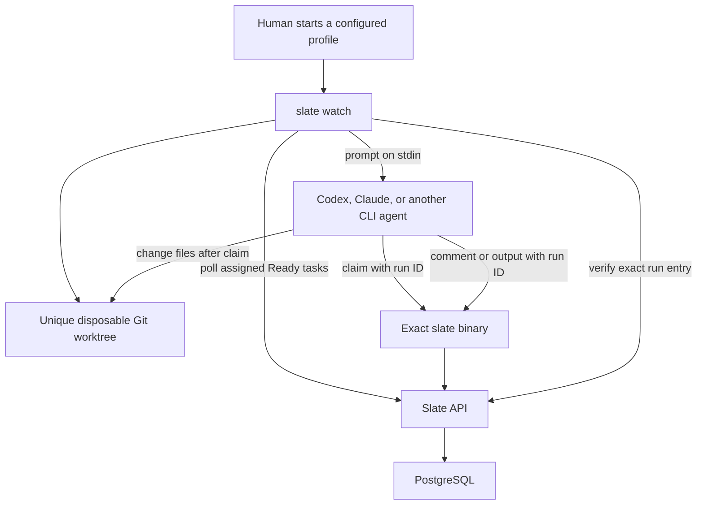

# Agent task watcher

> **Status:** Proposed for review

## 1. Executive summary

Slate agents can already list assigned Ready tasks, claim one, add an output, and move work into review, but a person must start and guide every coding-agent session. This change adds a long-running `slate watch` command for people who want Codex, Claude, or another command-line agent to process assigned coding work automatically. The watcher starts each candidate in a unique Git worktree. The coding agent then uses the Slate CLI to claim the task, read its context, implement it, comment with its result, and move it into review. Slate records a run ID so only the winning execution can update the task and the watcher can verify its exact output. The main costs are local worktree management, a Git-only first release, and passing a narrow Slate credential to the coding agent.

## 2. Context and scope

The current CLI is a stateless, one-command client. `slate tasks pull` lists queued actions, `slate tasks claim` atomically changes a queued action to working, and `slate tasks status` changes later workflow state. The API limits agent credentials to tasks assigned to their immutable agent ID. Card conversation entries support agent-authored comments and outputs. Creating an output stores the entry and changes the card to `needs_review` in the same transaction.

This design uses product and API status names together. Ready means `queued`, In Progress means `working`, and Review means `needs_review`. A managed run is a claim made by the watcher-launched CLI with a server-recorded run ID. Existing claims without a run ID are legacy runs.

This design changes the CLI boundary described in [ARCHITECTURE.md](../../ARCHITECTURE.md). The CLI becomes a long-lived local process that reads local profiles, creates isolated Git worktrees, starts one process group at a time, and monitors the selected run. PostgreSQL remains the source of truth. The server adds managed-run fencing and correlation while retaining legacy agent behavior.

Once shipped, a user can run one watcher for a Codex profile and another for a Claude profile. Each profile has a distinct Slate agent credential and executor command. A watcher only offers work assigned to the authenticated Slate agent. The coding agent owns claim, implementation, comment, and output. The watcher owns isolation, dispatch, monitoring, and cleanup of losing runs.

The first version supports local command-line executors, Git repositories with a clean checkout, and one task at a time per watcher. It does not provide hosted workers, remote repository checkout, automatic takeover of interrupted work, or automatic pull-request creation.

## 3. System context



The watcher and child `slate` commands use the same agent credential. The coding executor can access its generated worktree and run commands as the current operating-system user. It never receives the source checkout as its working directory. Slate does not otherwise sandbox the executor.

## 4. Proposed design

### How it works

A user creates a local profile named `codex`. The profile names an environment variable containing a Slate agent token, records the immutable agent ID expected from that token, and supplies an executor command as an argument array. The token itself is not stored in the profile.

The user changes into a Git repository and runs:

```bash
slate watch --profile codex
```

The watcher loads the profile, resolves its own executable path, reads the token, and calls `/api/v1/me`. It verifies that the credential resolves to the expected agent ID. It also verifies the executor, repository, current `HEAD`, and a clean source checkout. A personal token, identity mismatch, detached source `HEAD`, untracked or modified file, missing executor, or repository error stops startup.

The watcher checks for assigned working tasks inside its selected scope. `--board` scopes both this check and queued polling. A working task stops startup and tells the user to finish it or move it back to Ready. The first version has no automatic resume command.

During a normal run, the watcher polls for one assigned queued action. The server orders eligible work by priority, then age: P0, P1, P2, no priority, with the oldest task first inside each group.

When a candidate appears, the watcher creates a cryptographically random run ID, branch `slate/<task-id>-<run-short-id>`, and worktree beneath the operating system's user cache directory. Creation uses the verified source `HEAD`. Each run has a unique directory and branch, including when several machines or processes offer the same task.

The watcher launches the executor in that worktree as a new process group. It writes the complete prompt to stdin and then closes stdin. The child receives `SLATE_API_TOKEN`, `SLATE_BASE_URL`, `SLATE_RUN_ID`, and `SLATE_BIN`. `SLATE_BIN` is the absolute path of the running Slate binary. Its directory is prepended to the inherited `PATH`. The prompt uses `$SLATE_BIN` for every Slate command.

The prompt contains candidate metadata but not the task description or conversation. The coding agent's first task-specific command is:

```bash
"$SLATE_BIN" tasks claim <task-id>
```

When `SLATE_RUN_ID` is present, this command sends the run ID to the claim endpoint. A successful claim atomically changes `queued` to `working` and records that run ID. Only one competing run can win. Before claim, an executor may alter only its unique disposable worktree. If claim fails, it must exit. The watcher removes the losing worktree and branch even if the executor changed them.

After claiming, the agent runs `tasks get` and `tasks entries` to obtain the full description and conversation. It reads repository instructions, implements the task in its worktree, and runs relevant checks.

When blocked, the agent runs:

```bash
"$SLATE_BIN" tasks comment <task-id> \
  --file <comment-file> \
  --idempotency-key watch-run:<task-id>:<run-id>:blocked
```

The server tags the comment with the managed run ID. The task remains working. The watcher stops and retains the worktree for inspection.

When ready for review, the agent runs:

```bash
"$SLATE_BIN" tasks output <task-id> \
  --file <report-file> \
  --idempotency-key watch-run:<task-id>:<run-id>:output
```

The completion report states what changed, checks and results, branch and commit or pull-request links when present, and reviewer notes. The server first resolves an exact idempotency replay. For a new output, it verifies the assigned task is working and owned by the same run ID, stores the run-tagged entry, and moves the task to `needs_review` in one transaction.

The watcher queries the task and entries by its exact run ID while the executor is active and after it exits. The expected output plus `needs_review` means success. A run-tagged comment on a working task means blocked. Working with no run entry means interrupted. After detecting success, the watcher gives the executor ten seconds to exit and then terminates its process group. A successful or blocked worktree is retained and listed for the user. The watcher starts another task only after success; blocked or interrupted work stops it.

### Components and responsibilities

The watcher owns profile loading, startup validation, scoped polling, run identity, isolated branch and worktree creation, prompt transport, process-group lifecycle, exact-run monitoring, backoff, losing-run cleanup, and terminal output. It depends on the public Slate API, Git, the local executor, and the source checkout. It does not claim tasks, interpret requirements, modify task state, write card entries, or decide implementation quality.

The coding executor owns claim, context reads, repository changes, checks, blocked comments, completion output, and any commit or pull request required by repository instructions. It depends on its isolated worktree, the exact Slate binary, and its agent credential. It does not choose among the queue, manage another run, or bypass server fencing.

The one-shot CLI commands own request construction, run-ID propagation, file validation, JSON handling, retry metadata, and readable errors. They do not add authority beyond the server.

The Slate server owns immutable agent identity, assignment checks, queue ordering, atomic claim, managed-run fencing, entry correlation, entry idempotency, output-to-review transition, rate limits, and storage limits. It does not run executors, inspect Git, or judge results.

The worktree registry owns local run ID, task ID, agent ID, branch, worktree path, source repository, source commit, creation time, and disposition. It contains no token or task content. It does not establish server authority.

### Decisions

**The coding agent claims the task inside an isolated worktree.** Having the watcher claim was rejected because it splits the visible workflow across two actors. Giving competing agents the source checkout was rejected because prompt compliance cannot protect it. Isolation preserves agent-owned claiming while making pre-claim changes disposable. The cost is requiring Git and managing local worktrees.

**Managed runs use server fencing.** The run ID is recorded during claim and required on later agent mutations for that task. A stale or losing run receives `run_conflict`. Relying only on local locks was rejected because watchers can run on different machines. Automatic resume was rejected for v1 because safe takeover needs leases, expiry, and heartbeat policy.

**Managed and legacy claims coexist.** Existing agents that claim without a run ID keep their current status authority, including direct `needs_review`. A managed run must use output to enter review. A global breaking change was rejected because released CLI guidance and clients use the direct transition. The cost is maintaining two transition rules until a later version retires legacy claims.

**The coding agent posts its own output.** The server stores the output and review transition atomically. Having the watcher compose the comment was rejected because the coding agent owns the implementation evidence. The watcher verifies the exact run-tagged entry rather than trusting exit code or scanning recent comments.

**Prompt transport and binary selection are explicit.** The watcher writes the prompt to stdin, closes it, resolves its own binary path, supplies it as `SLATE_BIN`, and prepends its directory to `PATH`. Shell interpolation and an arbitrary `slate` earlier on `PATH` were rejected.

**The watcher requires a clean Git checkout and creates one branch per run.** Running directly in the current directory or copying arbitrary folders was rejected because losing claims and concurrent watchers need enforceable isolation. The cost is that non-Git tasks and dirty checkouts are not supported in v1.

**One watcher runs one process group at a time.** This bounds local concurrency and makes shutdown understandable. Child-only signalling was rejected because descendants could keep changing files.

**Managed runs cannot use the status command.** Claim establishes working state and output establishes review state. All direct agent status changes are rejected for a managed run, while a human can still requeue or complete the task. Allowing managed agents to set another status was rejected because it could bypass the required output or leave the watcher unable to classify the result.

**The server orders the queue.** Eligible work is ordered P0, P1, P2, unprioritized, then oldest first. Client-only sorting was rejected because tasks outside the returned page could starve.

## 5. Invariants and requirements

### Invariants

- `INV-1`: Every executor starts in a unique watcher-owned disposable worktree that no other run uses.
- `INV-2`: A managed claim succeeds only for a queued action assigned to the authenticated agent and records one run ID atomically.
- `INV-3`: At most one executor process group runs in one watcher.
- `INV-4`: A successful watcher run contains exactly one output entry authored by the assigned agent and tagged with its run ID.
- `INV-5`: A managed run enters `needs_review` only in the transaction that stores its completion output.
- `INV-6`: An exact idempotency replay returns the original entry before current task status or run ownership is validated.
- `INV-7`: A profile and local run registry never store a plaintext Slate credential.
- `INV-8`: A profile cannot start when its expected agent ID differs from the credential's agent ID.
- `INV-9`: The watcher never writes a bearer credential to its prompt, arguments, stdout, stderr, or registry.
- `INV-10`: A watcher does not launch another candidate while its launched task remains working.
- `INV-11`: A new managed output is accepted only for an assigned working task owned by the same run ID.
- `INV-12`: A losing or stale run cannot comment on, output to, or change the status of a task owned by another managed run.

### Requirements

- `slate watch --profile <name>` watches assigned queued actions across all visible boards. `--board` scopes both queued polling and the working-task startup check.
- `--workdir` selects the source Git checkout and defaults to the current directory. The executor runs only in the generated worktree.
- The source checkout must be on a named branch and have no staged, modified, deleted, or untracked files.
- The watcher offers the highest-priority, oldest eligible task first.
- Idle polling starts at five seconds and doubles to 60 seconds with up to 20 percent jitter. Healthy idle polling therefore occurs every 5 to 72 seconds.
- Polling retries connection failures, timeouts, and HTTP 429, 500, 502, 503, and 504. A valid delta-seconds `Retry-After` on 429 sets a minimum wait; the five-second exponential backoff capped at 60 seconds with 20 percent jitter always advances, and the longer of the two is used.
- HTTP 400, 401, 403, 404, and 409 are terminal for the current operation. Authentication and identity failures stop the watcher. Candidate claim conflicts return to polling after cleanup.
- Mutation commands do not retry automatically. The agent repeats a comment or output with the same required idempotency key after an uncertain result.
- Idle and failure backoff are separate. Any successful API response resets failure backoff; finding work resets idle backoff.
- The watcher generates a random UUID run ID before worktree creation and passes it through `SLATE_RUN_ID`.
- The watcher writes the prompt to executor stdin and closes it. Executor commands must be argument arrays and are never passed through a shell.
- The watcher creates a new process group on macOS and Linux and signals the whole group on shutdown or post-output termination.
- The prompt identifies agent, task metadata, run ID, worktree, claim rule, context commands, repository instructions, checks, blocked workflow, output workflow, and exact idempotency keys.
- `slate tasks entries` accepts optional `--run <run-id>` and returns only entries tagged with that managed run.
- `slate tasks comment` and `tasks output` accept exactly one of `--body` or `--file`; `--file -` reads stdin.
- Comment and output commands require a non-empty idempotency key and reject empty or over-16-KiB bodies locally.
- Any managed direct status change returns HTTP 409 `managed_run_status_locked`. The same status changes remain valid for legacy claims.
- A managed mutation with a missing or different run ID returns HTTP 409 `run_conflict`.
- The watcher retains successful, blocked, and interrupted worktrees. It automatically deletes only a run that failed to claim.
- The local registry holds at most ten retained worktrees per profile. Startup stops with cleanup instructions at the limit.
- `slate runs list` lists retained runs. `slate runs clean <run-id>` removes a worktree only when no child is active and the worktree is clean; it refuses dirty worktrees, never forces deletion, and retains the branch.
- Profile changes are loaded only at startup. Applying a change requires restarting the watcher.

## 6. Interfaces and data

### Commands

```text
slate watch --profile <name> [--board <board-id>] [--workdir <git-path>]

slate tasks entries <task-id> [--run <run-id>]
slate tasks comment <task-id> (--body <text> | --file <path|->) --idempotency-key <key>
slate tasks output <task-id> (--body <text> | --file <path|->) --idempotency-key <key>

slate runs list [--profile <name>]
slate runs clean <run-id>
```

The child commands read `SLATE_RUN_ID`. When present, claim, status, comment, and output requests send `X-Slate-Run-ID`. The watcher also sends this header when querying exact run state. The header must be a UUID. It is execution identity, not independent authority.

`POST /api/v1/agent/tasks/{id}/claim` accepts the optional run header. A managed claim writes `tasks.execution_run_id` in the same atomic update that writes `working`. A legacy claim omits it. A task carries a run only while it is working: any change of status or of assignee ends the run, and so does the output transaction, after its entry is stored.

`GET /api/v1/tasks/{id}` reports `executionRunId` while a managed run owns the task. A watcher cannot otherwise tell its own interrupted run from a claim another run won, and those need opposite cleanup. Collection responses do not carry it.

`POST /api/v1/tasks/{id}/entries` stores optional `run_id` from the authenticated managed run. For a new managed entry, the server locks the task and checks account, assignment, working status, and matching run ID. It first looks up an exact idempotency replay using task, author, and key. A matching replay succeeds from `needs_review` or `done`; a reused key with different content conflicts.

`GET /api/v1/tasks/{id}/entries?runId=<id>` returns entries for that exact managed run. An agent credential may query only its assigned task. The response exposes `runId` but not the idempotency key.

For a managed run, `PATCH /api/v1/agent/tasks/{id}/status` returns HTTP 409 `managed_run_status_locked` even with the matching run header. A stale or missing run identity returns `run_conflict`. Legacy agent claims retain current behavior. Account sessions and personal tokens retain their current authority, including requeue and completion. A human status change away from working clears the managed run ID.

`GET /api/v1/me` adds optional `agentPurpose` for agent credentials and a `managedRuns` capability boolean. The watcher refuses to start unless `managedRuns` is true. This allows the server to deploy before the new CLI without enabling an incomplete workflow.

The queue response keeps its current shape. The server changes `GET /api/v1/agent/tasks` ordering to priority rank, `created_at`, then task ID. Existing filters remain available.

### Database and rollout

A migration adds nullable `tasks.execution_run_id uuid` and nullable `card_entries.run_id uuid`, plus an index on `(task_id, run_id, created_at, id)`. Existing rows remain legacy because both values are null.

Rollout is additive and ordered:

1. Deploy the migration and server support for run headers, correlation reads, new error codes, queue ordering, and `managedRuns: true`. Legacy requests remain unchanged.
2. Release the CLI with `tasks entries`, `tasks comment`, `tasks output`, managed headers, worktree registry, and watcher.
3. Update CLI documentation to recommend output for all agents. Managed runs enforce it immediately; legacy direct review remains compatible.

Rollback disables `managedRuns` first so new watchers refuse startup, then rolls back the CLI or server. Nullable columns remain harmless to old code. Dropping them is a separate cleanup migration after rollback risk has passed.

### Local profile and registry

The CLI reads JSON from `SLATE_CONFIG` when set, or `slate/config.json` beneath the operating system's user configuration directory:

```json
{
  "profiles": {
    "codex": {
      "agentId": "4fb10cce-f7c8-43bb-9d43-9bcb2bacaf08",
      "tokenEnv": "SLATE_CODEX_TOKEN",
      "command": ["codex", "exec", "-"]
    }
  }
}
```

Required fields are `agentId`, `tokenEnv`, and a non-empty `command`. Unknown fields are rejected. The command is an example, not a built-in default. The executable is resolved through `PATH` at startup and then invoked by absolute path. Relative `--workdir` values are resolved from the starting directory.

Registry records are JSON files beneath the user state directory, written atomically with owner-only permissions. Each record contains run ID, profile name, agent ID, task ID, board ID, branch, worktree, source repository, source commit, state, child PID and process-group ID while active, and timestamps. Child identifiers are cleared after exit. The registry is not used for server authorization.

### Prompt envelope

The prompt contains authenticated agent ID, display name, purpose, candidate metadata, run ID, absolute worktree, claim and context commands, repository-instruction requirement, verification requirement, blocked and output contracts, exact idempotency keys, and the rule to exit after reporting.

The prompt does not contain the token, task description, conversation, source-checkout path, or unrelated environment values. The agent obtains task content through assigned CLI reads after claim.

### Naming and identity

Slate creates immutable agent UUIDs on the server. The profile stores the expected ID and startup fails when it is missing, malformed, deleted, or differs from the credential result.

The watcher creates a random UUID run ID. The server binds it to one assigned task during atomic claim. A later display-name or profile-name change does not alter run ownership or stored entry authorship.

Branch and worktree names derive from validated task and run UUIDs, not task text. If a generated path already exists or Git creation fails, the watcher records no active run and starts no executor.

## 7. Failure behavior and lifecycle

Startup validates configuration, identity, server capability, API reachability, executor, clean source checkout, Git branch, registry capacity, and scoped working tasks. Invalid local state or HTTP 400, 401, 403, 404, or 409 exits nonzero. Retryable startup failures use the defined failure backoff until interrupted.

With no eligible task, the watcher uses idle backoff. A newly eligible task is observed within 72 seconds while the API is healthy and no executor is active.

If worktree or executor creation fails before claim, the watcher removes any partial watcher-owned directory and branch, marks the run failed locally, and retries the candidate. Five consecutive local launch failures stop the watcher.

If claim fails, the executor exits. The watcher waits up to ten seconds, terminates its process group if needed, and removes the disposable worktree and branch. A claim conflict returns to polling. Authentication or server-capability failure stops the watcher.

If an exact output request commits but its response is lost, repeating the same key returns the stored entry before status and run checks. This works after the task reaches review or done. A changed body with the same key conflicts.

If a stale process attempts a mutation after another managed run owns the task, the server returns `run_conflict`. It cannot add a comment, post output, or change status. A human moving a task back to Ready clears the old run ID; the next managed claim establishes a new fence.

If the agent posts a blocked comment, exits without an entry, or crashes after claim, the task stays working and the worktree is retained. The watcher stops with task, run, branch, worktree, and recovery guidance. Recovery in v1 is manual: inspect or commit useful changes, stop any remaining process, move the task to Ready, and let a new isolated run claim it. There is no automatic resume or takeover.

The watcher checks exact run state every five seconds while the executor runs. When it observes the run output and review state, it waits ten seconds for normal exit, then sends `SIGTERM` to the process group, waits ten more seconds, and sends `SIGKILL` to the group. `SIGINT` or `SIGTERM` sent to the watcher uses the same group shutdown sequence and never changes task state.

Credential revocation makes the next operation fail authentication. The watcher terminates the process group and exits. Configuration is immutable during a run. Agent purpose and profile changes take effect after restart; entry author names use server state at write time.

## 8. Security, privacy, and operations

Task content, repository files, executor output, profiles, command arrays, API responses, and environment values are untrusted. The CLI validates IDs and paths, executes arrays without a shell, restricts entry sizes, and relies on server account, assignment, status, and run fencing.

The child receives only the configured agent credential, never a session or personal token. The token is placed in `SLATE_API_TOKEN`, omitted from prompts and arguments, and redacted from errors. Slate cannot prevent a process running as the same operating-system user from reading its environment or other user-accessible secrets. Users must run watchers only for trusted boards and repositories.

The executor sees only its generated worktree as the working directory. This prevents a losing claim from changing the source checkout or another run, but it is not an operating-system sandbox. Absolute paths, network access, and other user-readable files remain reachable.

The watcher owns generated losing-run directories and may delete them even when the executor changed them. It never force-deletes retained successful, blocked, or interrupted worktrees. Registry and config files use owner-only permissions and contain no credentials.

One watcher uses one executor process group and one outstanding API request. Idle and active monitoring use at most 12 reads per minute before retries. Several profiles share account limits, so 429 handling is required.

Each retained worktree consumes repository-sized disk space. The per-profile limit of ten prevents unbounded local accumulation. At the limit, no executor starts. Users inspect `slate runs list` and clean committed runs explicitly.

Task descriptions and entries retain their existing 16 KiB limits, and a card retains its 200-entry limit. At an entry or storage limit, the CLI reports the server error, the task remains working, the worktree is retained, and the watcher stops.

The watcher streams child output to the terminal and stores no prompt or execution log. Output may contain task or repository data. Executor tokens, duration, and provider spend remain externally controlled; signals are the user-controlled runtime limit.

## 9. Acceptance criteria

- `AC-1`: A valid profile and assigned queued task launch the configured executor in a unique worktree with the correct identity, metadata, run ID, stdin prompt, and exact Slate binary.
- `AC-2`: Competing executors receive different worktrees; a failed claim causes its watcher-owned worktree and branch to be removed, and no run uses the source checkout as its working directory.
- `AC-3`: Two watchers can offer the same task, but exactly one managed claim records its run ID; the losing run is fenced and cleaned.
- `AC-4`: A successful run creates exactly one output tagged with its run ID, and that transaction leaves the task in `needs_review`.
- `AC-5`: Retrying an output after an uncertain response returns the original entry from both `needs_review` and `done` without a duplicate.
- `AC-6`: A blocked run creates one run-tagged comment, leaves the task working, retains its worktree, and stops its watcher.
- `AC-7`: An executor that exits after claim without a run entry leaves the task working, retains its worktree, and stops without another launch.
- `AC-8`: A normal watcher refuses to start for a scoped working task; v1 provides no concurrent resume path.
- `AC-9`: A personal, revoked, missing, or mismatched credential fails before worktree or executor creation.
- `AC-10`: Healthy idle polling occurs every 5 to 72 seconds; retryable failures and 429 responses follow the specified independent backoff rules.
- `AC-11`: Signals and post-output timeout terminate the whole executor process group on macOS and Linux without changing task state.
- `AC-12`: Legacy claims retain direct status changes; managed runs return `managed_run_status_locked` for direct status changes and must post output to reach review.
- `AC-13`: Missing or stale run identity cannot mutate a managed task, and output before successful managed claim fails.
- `AC-14`: The watcher verifies success or blockage using only entries tagged with its exact run ID.
- `AC-15`: `--board` scopes both queued polling and the working-task startup check.
- `AC-16`: Ten retained worktrees stop new launches for that profile until a committed run is cleaned.

## 10. Test approach

CLI unit tests use `httptest.Server`, temporary Git repositories, fake executables, controlled clocks, and deterministic UUIDs. They prove profile and identity validation, capability checks, clean-checkout rules, worktree isolation and cleanup, registry capacity, stdin prompt delivery, exact binary selection, board scoping, separate backoffs, `Retry-After`, terminal errors, exact-run monitoring, and post-output timeout. These cover `INV-1`, `INV-3`, `INV-7` through `INV-10`, `AC-1`, `AC-2`, and `AC-7` through `AC-16`.

Process tests on macOS and Linux start a fake executor with a child and grandchild. They prove signal and kill delivery to the complete process group for `AC-11`.

Command tests prove entries run filters, managed headers, comment and output bodies, idempotency headers, file and stdin handling, local size checks, and structured errors. These cover `INV-6`, `INV-9`, `AC-4`, `AC-5`, `AC-13`, and `AC-14`.

A two-watcher integration test gives both fake executors distinct worktrees and delays their claims. It proves one atomic winner, server fencing, losing-worktree deletion, source-checkout preservation, and no cross-run file collision. This covers `INV-1` through `INV-3`, `INV-12`, `AC-2`, and `AC-3`.

PostgreSQL-backed server tests prove account and agent scoping, one managed claim winner, legacy compatibility, run conflict behavior, queue ordering, exact run filtering, idempotency-before-state validation, replay from review and done, and atomic output-to-review. These cover `INV-2`, `INV-4` through `INV-6`, `INV-11`, `INV-12`, `AC-3` through `AC-5`, and `AC-12` through `AC-15`.

Existing CLI, server, migration, integration, and browser suites prove legacy compatibility. The implementation gate is `just test-ci` and `just build`.

Manual Codex and Claude smoke tests in disposable repositories verify current non-interactive stdin and exit behavior. Unsupported behavior removes that command example from documentation; it does not weaken the generic stdin contract.

## 11. Risks and tradeoffs

- Task content can instruct the executor to expose its environment or reach and change files outside the worktree. Agent credentials and separate working directories reduce accidental collision but do not provide an OS sandbox.
- Competing watchers may start paid executor sessions before one loses the claim. Isolation and server fencing protect correctness but not startup cost.
- A crash after claim leaves a working task and retained worktree. Manual requeue is deliberate because automatic takeover needs a lease design.
- A dirty source checkout is rejected, which may interrupt an existing developer workflow. This prevents silently omitting local changes from the worktree base.
- A locally configured executor command may change across tool versions. Startup validation and manual smoke tests expose incompatibility.
- A large conversation may consume substantial model context. Existing entry limits bound storage but not provider cost.
- Maintaining legacy and managed transition rules adds server complexity. The distinction is explicit, nullable, and removable in a later breaking release.

## 12. Open questions

- Should the first release include commands to create and edit profiles? Recommended default: document the JSON file and add editing commands after the shape has been used. This does not block task breakdown.
- Should `tasks entries` add pagination or a byte budget before watcher release? Recommended default: retain the currently bounded response and measure real sizes. This does not block task breakdown.
- Which current Codex and Claude argument arrays satisfy the stdin and exit contracts? Verify them during documentation work and publish only tested examples. This does not block the generic implementation.

## 13. Implementation notes

These points were settled while building the change and differ from the text above as first approved. Each is deliberate and carries a comment in the code.

- **`Retry-After` is a minimum, not an exact delay.** RFC 9110 section 10.2.3 defines the header that way. Honoring a shorter hint than the current backoff would let a `Retry-After: 0` from a misconfigured proxy become a request flood aimed at an account that is already rate limited.
- **HTTP 500 is retryable.** The original list named 502, 503 and 504. A single transient 500 ending a day-long session contradicts the stated outcome that temporary server failures do not stop the watcher.
- **A reply that is not the API's is terminal.** A proxy serving an error page with a success status will keep serving it, so repeating the request cannot help.
- **A run the watcher could not place is retained, not deleted.** Deleting a worktree is unrecoverable, so it requires positive evidence that the run never held the task. A run that was ever seen to own or write to its task, or whose supervision hit a read failure, keeps its worktree and is reported as ambiguous.
- **The prompt tells the agent to write its report outside the worktree.** A report file left inside counts as uncommitted work and blocks `slate runs clean` for ever.
- **`slate runs clean` releases a crashed watcher's record.** Nothing from such a run is alive, so its worktree must still be removable.

## 14. Out of scope

- Hosted or server-side executors.
- Non-Git workspaces in v1.
- Webhooks, server-sent events, or push delivery.
- Multiple concurrent tasks in one watcher.
- Automatic resume, leases, expiry, heartbeat, or takeover of working tasks.
- Automatic commits, pushes, pull requests, merges, or forced worktree deletion.
- Judging implementation quality beyond reported checks and human review.
- Hiding a credential from another process with the same operating-system authority.
- Built-in executor authentication, billing, model selection, or sandboxing.
